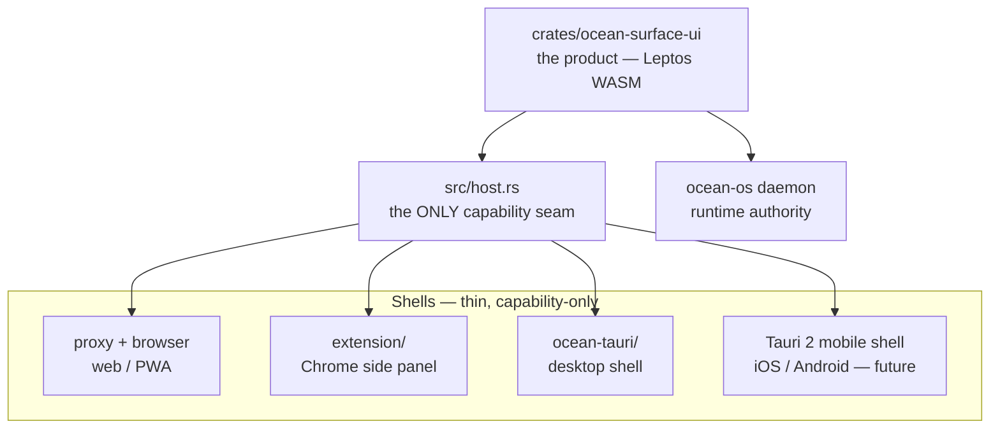

# Ocean Platform Contract — one core, many shells

> The alignment layer between the web team and the desktop (Tauri) team, and
> the trajectory to mobile. The desktop split itself is designed in
> `OCEAN_DESKTOP_NORTH_STAR.md` (Surface Capability Matrix); this document is
> the cross-team contract both sides build against. Binding for every agent
> session working this repo.

## The shape

- `crates/ocean-surface-ui` **is the product**. The same WASM core renders the
  web app, the PWA, the extension side panel, the desktop app's content — and
  eventually the mobile app. There is no "desktop UI codebase" and no "mobile
  UI codebase"; there are shells around one core.
- Shells stay thin: bootstrap, serve the bundle, provide OS capabilities.
  Product behavior never lives in a shell.
- `src/host.rs` is the **only** seam through which platform capability enters
  the core. Every function no-ops (or returns `None`/`false`) off its
  platform: `notify`, `set_badge`, `on_deep_link`, `pick_folder`,
  `watch_paths`/`on_path_changed`, `on_menu_command`, `repo_state`,
  `daemon_status`/`start`/`stop`/`restart`, `on_daemon_status`. UI mounts
  platform features conditionally on host signals — a missing capability
  renders as *absence*, never as an error or dead chrome.

## The sorting rule

For any new feature, ask **"does the phone version need this?"**

- **Yes** → shared core. It must work over daemon HTTP/SSE alone, carry no
  `host::` hard dependency, and have a compact/touch rendering (see Mobile).
- **No — it's about the machine** (processes, tray, dock, filesystem, git,
  deep links, global shortcuts, multi-window) → desktop: implement as an
  `ocean-tauri` command, expose through `host.rs`, mount conditionally.
  The north star's Capability Matrix is the canonical inventory.
- **Web-only mechanics** (service worker, PWA manifest, install prompts) live
  in the web shell (`index.html`, `sw.js`), never in core.

The daemon owns everything else (providers, sessions, permissions, tools) —
per the root AGENTS.md, surfaces render state and collect intent.

## Mobile: the web app is the bones

Tauri 2 ships iOS and Android. The desktop shell pattern **is** the mobile
pattern — a `tauri.conf` target, the same host seam, a different capability
set (push notifications, share sheet, haptics, app lifecycle). Nothing about
mobile requires a rewrite; it requires the core to stay mobile-clean:

1. **PWA is the mobile v0.** Zero-install, already installable; web push is
   its notification story. Ship-blocking mobile bugs are PWA bugs today.
2. **`styles/compact.css` is the mobile stylesheet.** The extension side
   panel (~380px) is our standing narrow-viewport proof; anything that works
   there works on a phone. New core UI must land with its compact behavior in
   the same slice — not as a follow-up.
3. **Touch is first-class.** No hover-only affordances: every hover reveal
   needs a visible floor (cf. `.voice-trigger`'s 0.35 opacity floor) or a tap
   path. Hit targets ≥ 20px. Safe-area insets are already tokenized in
   `base.css` (`env(safe-area-inset-*)`) — new full-bleed chrome must respect
   them.
4. **Capability absence = clean absence.** A phone has no daemon supervision,
   no git, no workspace panes; those mounts must disappear without leaving
   holes (the `Option`-signal pattern the supervision indicator uses).

## Working agreement — parallel sessions

Learned the hard way (2026-07-08: split hunks left main unbuildable; an
uncommitted module wired into `app.rs` broke every in-repo build):

1. **Ownership.** The web session owns core product modules (transcript,
   sessions, voice, rooms, council, icons, styles). The desktop session owns
   `ocean-tauri/`, `host.rs`, and desktop deck modules (workspace, cockpit,
   repo/files panels). `app.rs` is shared ground.
2. **Shared-file discipline.** Additions to `app.rs` (and any shared file)
   are: a `host::` call + a conditional mount, in the smallest possible hunk,
   committed promptly. Uncommitted cross-references from shared files into
   new modules are prohibited — `mod x;` + usage lands only when `x` compiles
   and its tests pass.
3. **Main must build standalone.** GitButler lanes split interdependent
   hunks; before any push to main, verify the pushed tree in a detached
   worktree (`cargo test -p ocean-surface-ui` + wasm check). Content on main
   that references unlanded files is a regression even if your working tree
   is green.
4. **One design system.** `OCEAN_WEB_SURFACE_DESIGN.md` binds every shell,
   including desktop deck panels: colors only from `tokens.css`, stroke icon
   family from `icons.rs` (no emoji glyphs in UI), conditional rendering over
   permanent chrome.
5. **Voice/provider credentials** are daemon-bound (per root AGENTS.md); no
   shell grows provider calls. Mobile inherits this for free — the phone
   never holds keys.
